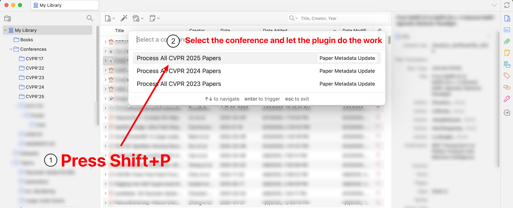
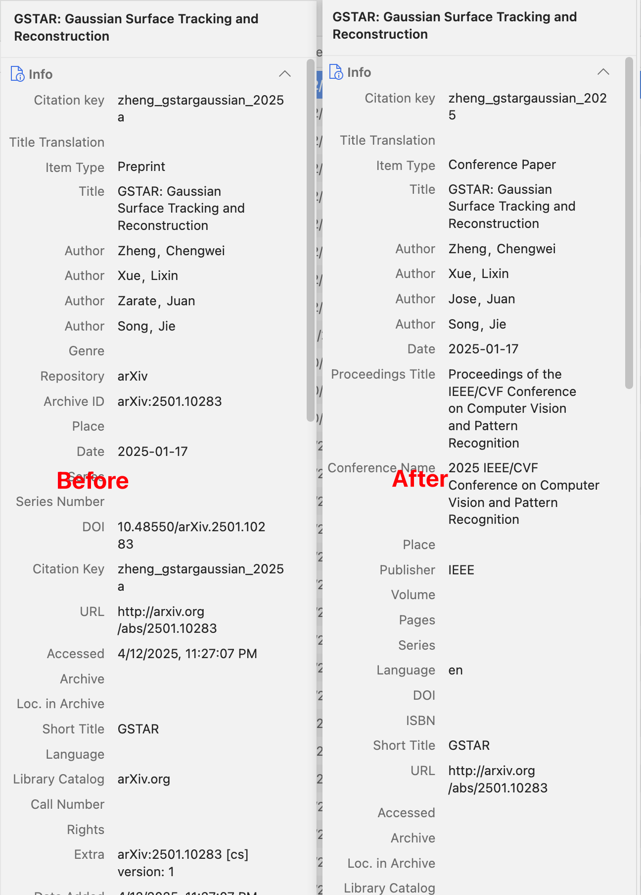

# Zotero Update Arxiv Metadata

---

> **Automatic Metadata Updates**: Automatically updates metadata for **preprints** in Zotero when they are **published** in _conferences_.

### Installation

1. Download the plugin from the [Releases](https://github.com/wuzirui/paper-meta-update/releases) page;
2. In Zotero click Tools in the top menu bar and then click Plugins
3. Go to the Extensions page and then click the gear icon in the top right.
4. Select Install Plugin from file.
5. Browse to where you downloaded the .xpi file and select it.
6. Finish!

### Usage

1. Press `Shift-P` to callout the conference selection panel;
2. Select the target conference name (this is automatically updated according to the [source](https://wuzirui.github.io/conference-accepted-papers/)).
   
3. Let the plugin finish processing.
   

### Listed Conferences

The plugin automatically fetches and updates the list of supported conferences from the source. This ensures that the metadata is always up-to-date with the latest conference proceedings.

- Current listed conferences include:

  - CVPR 2013~2025;
  - ICCV 2013, 2023;
  - WACV 2020~2025;
  - Find the full list [here](https://wuzirui.github.io/conference-accepted-papers/conf/index.json).

- Upcoming:
  - ECCV;
  - NeurIPS;
  - ICLR;
  - IROS/ICRA/RSS;
  - More upon request (Issues/PRs welcomed!)...

### Updates

1. [2025-04-16] Use case insensitive search instead of sensitive, will make the search a bit slower.
